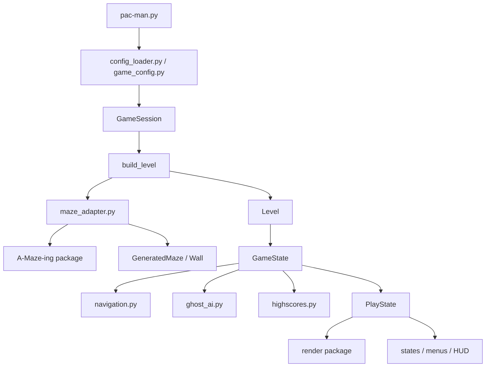

# Decisions

This file records the main technical and organization decisions made during the project.

## Decision log

| Decision | Final choice | Reason | Impact |
| --- | --- | --- | --- |
| Branch workflow | Use feature branches merged through `develop`. | Reduced integration risk and made progress easier to review. | Each feature had a clear scope and merge point. |
| Config ownership | Put typed config models and validation in a dedicated config layer. | The subject requires configurable values, comments, defaults, and no crash on bad config. | Gameplay receives validated data instead of raw JSON. |
| Maze generation | Use the assigned A-Maze-ing package as-is behind `pacman/maze_adapter.py`. | Required by subject; adapter isolates external API details. | Future gameplay/render code depends on internal `GeneratedMaze`, not external package output. |
| Internal maze model | Convert generator output into `GeneratedMaze` and `Wall`. | Keeps pathfinding, rendering, collectibles, and collision independent from generator internals. | Centralized representation for all maze consumers. |
| `PERFECT=False` | Always request Pac-Man-compatible non-perfect corridors. | Perfect mazes are too tree-like for Pac-Man gameplay. | More usable corridors and loops. |
| Runtime level model | Add a `Level` object. | Needed a clean bridge between config, generated maze, spawns, timer, and gameplay state. | Gameplay systems use stable per-level data. |
| Gameplay state split | Separate `GameState` from `GameSession`. | Per-level state resets between levels; score/lives/current level persist. | Level progression became easier to reason about. |
| UI/render integration | Keep the clean gameplay architecture as source of truth and selectively integrate UI/render work. | Prevented incompatible gameplay models from coexisting. | UI/render observes gameplay state instead of owning separate world logic. |
| Highscores | Store highscores in JSON with validation and top-10 sorting. | Simple, inspectable, robust enough for the subject. | Easy to document and recover from missing/corrupt files. |
| Cheat mode | Add review tools to gameplay flow and pause menu. | Subject asks for useful review helpers. | Reviewers can test level clear, game over, invincibility, ghost freeze, and extra lives. |
| Ghost AI quality pass | Improve ghost movement after MVP instead of aiming for arcade-perfect AI early. | The first greedy movement was compliant but felt bad. | Path-aware movement and personalities improved game feel without a full rewrite. |
| Dead-end cleanup | Post-process internal `GeneratedMaze` after external generation. | Smarter ghosts made excessive dead ends unfair. | Playability improved while still using the external generator as-is. |
| Render/gameplay desync | Accept as a known limitation unless QA proved it game-breaking. | Proper fix would touch movement, collision, and interpolation architecture late in the project. | Avoided risky final-week refactor. |
| Settings screen | Hide the non-functional Settings entry from the main menu. | A fake player-facing feature hurts polish more than it helps. | UI remains cleaner while the state code stays reversible. |
| Packaging | Use PyInstaller `onedir` packaging and zip the output for Itch.io. | Simple, inspectable, and peer-review friendly. | Provides a reproducible Linux build workflow. |

## Architecture overview

## Decision process

- Defense-critical and architecture-heavy decisions were discussed before implementation.
- Risky gameplay changes were split into focused branches.
- Late-stage work avoided broad refactors unless the issue was a compliance blocker.
- Final documentation and packaging were completed only after gameplay, UI, and project evidence stabilized.
