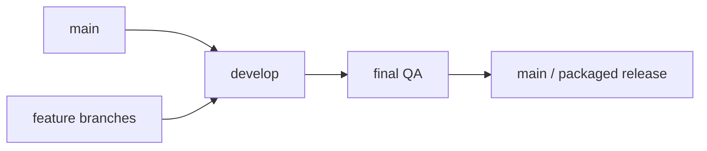

# Team organization

## Team members

| Member | Main responsibilities |
| --- | --- |
| Hugo | Core architecture, config loader, maze adapter, gameplay state, movement, pellets/scoring, ghosts, game outcomes, level progression, cheat mode, ghost AI cleanup, final compliance support. |
| Nico | UI/render/menu work, visual assets and animation integration, HUD, gameflow screens, highscore/input screens, presentation polish, packaging support. |
| Both | Integration, manual testing, merge review, project-management evidence, final QA, defense preparation. |

## Work organization

The team used a feature-branch workflow:

General rules:

- New features were developed on dedicated branches.
- `develop` acted as the integration branch.
- `main` was treated as the release-ready branch.
- Defense-critical work was kept in small, reviewable increments when possible.
- Late changes were restricted to bug fixes, compliance, documentation, packaging, or very small polish.

## Branch ownership model

| Area | Primary owner | Notes |
| --- | --- | --- |
| Config and CLI | Hugo | High defense risk: wrong args, config errors, defaults, comments. |
| Maze adapter | Hugo | Required isolation of assigned external package. |
| Gameplay architecture | Hugo | `Level`, `GameState`, `GameSession`, navigation and ghost AI. |
| UI/render/menu | Nico | Menus, HUD, screens, visual integration, animations. |
| Highscore UX | Nico / Both | Persistence logic and UI flow needed coordination. |
| Level progression and cheats | Both | Touched gameplay, UI, and review flow. |
| Final docs/project evidence | Both | Source material came from task/branch/test tracking and final repo state. |
| Packaging/release | Nico / Both | Needs final smoke test and instructions. |

## Review and definition of done

A feature was considered done when:

- The branch stayed within its agreed scope.
- The code used the current architecture instead of introducing a second gameplay model.
- `make lint` passed when applicable.
- `make run` launched and the feature could be manually tested.
- Important behavior was validated manually.
- The branch was merged through the integration flow.

## Collaboration notes

During development, some gameplay and UI/render work diverged. The team resolved this by using the clean gameplay architecture as the source of truth and adapting useful UI/render pieces around it. This reduced long-term conflict risk and made the final game easier to explain during defense.

The goal of the team process was pragmatic: keep enough evidence for the subject and defense, while prioritizing a working game and understandable architecture.
