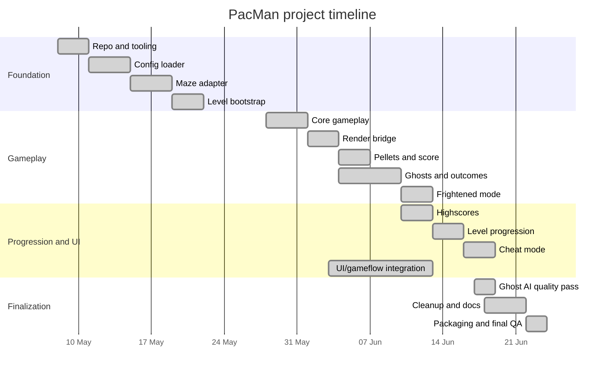

# Timeline

This timeline summarizes the planned progression and actual implementation order for the PacMan project.

## Planned phases

| Phase | Goal | Main owner(s) |
| --- | --- | --- |
| M0 - Repository and tooling | Project skeleton, Makefile workflow, entry point, linting setup. | Hugo |
| M1 - Config and maze adapter | JSON configuration, robust error handling, A-Maze-ing adapter. | Hugo |
| M2 - Minimal playable game | Runtime level model, player state, visible movement, pellets, and scoring. | Hugo |
| M3 - Ghosts and outcomes | Ghost state, autonomous movement, collisions, lives, game over, frightened mode. | Hugo / Both |
| M4 - UI and game flow | Menus, HUD, pause, instructions, game over/victory, visual integration. | Nico / Both |
| M5 - Progression and review tools | Highscores, multiple levels, timer, score/life carryover, cheat mode. | Both |
| M6 - Finalization | Ghost AI quality pass, cleanup, docs, packaging, release build, defense QA. | Both |

## Actual progression

| Order | Delivered work | Branch / area | Outcome |
| --- | --- | --- | --- |
| 1 | Project skeleton and Makefile workflow. | Foundation | Basic entry point and developer commands established. |
| 2 | Config loader with defaults, clamping, comments, and no-traceback handling. | `feature/config-loader` | Config-driven setup completed. |
| 3 | External A-Maze-ing integration behind an adapter. | `feature/maze-adapter` | Generator isolated from the rest of the codebase. |
| 4 | Runtime `Level` model. | `feature/level-bootstrap` | Generated maze data became usable by gameplay systems. |
| 5 | Mutable gameplay state and player movement. | `feature/core-gameplay` | First playable logical movement slice. |
| 6 | Rendering bridge. | `feature/gameplay-render-bridge` | Maze and player became visible from the clean gameplay model. |
| 7 | Pacgums, super-pacgums, and scoring. | `feature/player-pellets-score` | Collection and score rules implemented. |
| 8 | UI/gameflow reconciliation. | Integration branch | UI/render work was aligned with the clean gameplay architecture. |
| 9 | Ghost state and autonomous movement. | `feature/ghost-state`, `feature/ghost-ai` | Four ghosts spawned, rendered, and moved autonomously. |
| 10 | Timed Pac-Man movement and queued turns. | `feature/player-movement-flow` | Movement became closer to expected Pac-Man behavior. |
| 11 | Collisions, lives, timer, game over, level clear. | `feature/game-outcomes-flow` | Core win/loss loop completed. |
| 12 | Frightened mode and edible ghost respawn. | `feature/ghosts-frightened-mode` | Power-pellet loop completed. |
| 13 | Persistent highscores. | `feature/highscores` | Top-10 JSON highscore system integrated. |
| 14 | Multi-level progression. | `feature/level-progression` | Ten-level campaign with score/life carryover. |
| 15 | Cheat mode. | `feature/cheat-mode` | Review tools added for peer evaluation. |
| 16 | Ghost AI quality pass and maze dead-end cleanup. | `feature/ghost-ai` | Path-aware ghost behavior and playability improvements. |
| 17 | Compliance cleanup. | `docs/docstring-compliance` / final cleanup | Docstrings, settings hiding, layout audit, dependency handling, ghost overlap fix, and legacy error cleanup completed. |
| 18 | Documentation and project evidence. | Final docs | Project-management evidence and root README completed. |
| 19 | Packaging and release. | Final packaging | PyInstaller workflow added, Linux archive built, Itch.io release uploaded, and final QA performed. |

## Visual timeline

## Changes compared with the original plan

- The architecture plan was adjusted after teammate work diverged: the team promoted a clean gameplay architecture and selectively integrated UI/render work.
- Level progression and cheat mode were split into separate branches to reduce risk.
- Ghost AI improvements were added late because the first autonomous movement version was functional but visibly oscillatory.
- Project evidence, README, packaging, and defense QA were finalized after gameplay and UI stabilized.
